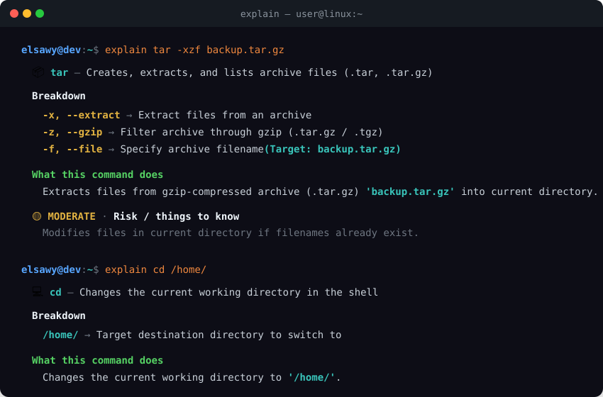
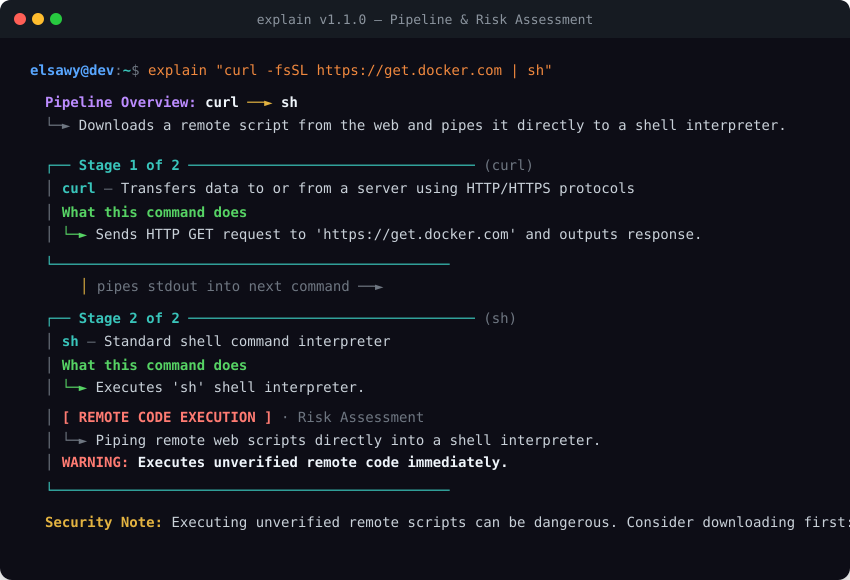

<div align="center">

# 💡 explain

**Demystify Linux terminal commands in seconds.**  
*A lightweight, zero-dependency, 100% offline CLI tool written in Go that breaks down complex terminal commands, explains their flags, and highlights safety risks before you run them.*

<br/>

[](https://github.com/Yehya-Elsawy/explain-/releases)
[](https://golang.org)
[](LICENSE)
[](https://github.com/Yehya-Elsawy/explain-#-supported-platforms--distributions)

<br/>



</div>

---

## 💻 Supported Platforms & Distributions

`explain` is compiled as a single standalone static binary with **zero external dependencies**, working seamlessly across:

<div align="center">


| Architecture | Linux | macOS | Windows (WSL) |
|---|:---:|:---:|:---:|
| **x86_64 / amd64** (Intel & AMD) | ✅ Supported | ✅ Supported (Intel) | ✅ Supported |
| **arm64 / aarch64** (Apple Silicon, Raspberry Pi, AWS Graviton) | ✅ Supported | ✅ Supported (M1/M2/M3/M4) | ✅ Supported |
| **i386 / 32-bit** | ✅ Supported | — | — |

</div>

---

## 🎯 Why `explain`?

When beginners copy commands from ChatGPT, StackOverflow, or tutorials, they often don't know what cryptic flags (`-xzvf`, `-laht`, `-p 8080:80`, `| sh`) actually do.

- Reading full `man` pages is overwhelming.
- Asking online AI models requires internet access, API keys, and context switching.
- Running commands blindly can lead to accidental data loss (`rm -rf`, `> file`, `dd`).

With `explain`, you just prepend `explain` before any command:

```bash
explain tar -xzf backup.tar.gz
```

---

## ✨ Features

- **⚡ Zero Dependencies & 100% Offline**: Single static binary (<5MB). Instant execution (<5ms) with no network calls or API keys required.
- **🧩 Smart Flag Decomposition**: Unpacks clustered short flags (e.g., `-xzvf` $\to$ `-x`, `-z`, `-v`, `-f`) and maps them to their values.
- **💬 Shell Builtins & Navigation**: Understands `cd`, `pwd`, `echo`, `export`, `alias`, `clear`, and path transitions (`..`, `~`, `-`).
- **🔗 Pipeline & Redirect Aware**: Understands multi-stage pipelines (`ps aux | grep nginx | awk ...`) and I/O redirections (`>`, `>>`, `2>&1`).
- **🛡️ Safety & Danger Meter**: Warns against destructive operations (`rm -rf /`, `dd of=/dev/sdX`, `chmod 777`, `curl ... | bash`).
- **📖 Dynamic Man & Help Fallback**: Real-time extraction from local `man` pages and `--help` for any unlisted command installed on your system.
- **🎨 Modern & Compact Terminal UI**: Beautiful ANSI colors and aligned columns designed to give you everything in 5–8 clean lines.
- **🚀 Interactive Safe Runner**: Use `explain -i` to paste complex pipelines without quotes, or `explain -r "<command>"` to execute with confirmation.
- **🔄 Built-in Self Updater**: Run `explain update` to automatically upgrade to the latest GitHub release.

---

## 🛡️ Safety & Hazard Detection

<div align="center">
  
</div>

---

## 🚀 Installation & Updating

### 1. One-Line Installer (Recommended)
Works on any Linux distribution and macOS:
```bash
curl -fsSL https://raw.githubusercontent.com/Yehya-Elsawy/explain-/main/scripts/install.sh | bash
```

### 2. Updating `explain` to Latest Release
Whenever a new version is released, simply run:
```bash
explain update
```

### 3. Go Install
```bash
go install github.com/Yehya-Elsawy/explain-/cmd/explain@latest
```

### 4. Build from Source
```bash
git clone https://github.com/Yehya-Elsawy/explain-.git
cd explain-
make
make install
```

---

## 📖 CLI Usage

```text
USAGE:
  explain <command with arguments>
  explain "<piped | or compound command>"
  explain -i (interactive mode - no quotes needed)
  explain update (auto-update to latest release)

EXAMPLES:
  explain tar -xzf backup.tar.gz
  explain cd /home/
  explain "rm -rf /tmp/cache"
  explain "find . -name '*.log' -mtime +30 -delete"
  explain "ps aux | grep nginx | awk '{print $2}' | xargs kill -9"
  explain "curl -fsSL https://get.docker.com | sh"

OPTIONS:
  -i, --interactive Launch interactive mode (paste complex pipelines without quotes)
  -r, --run         Ask to run the command after explaining it
  -u, --update      Update explain CLI to the latest version from GitHub
  --json            Output structured analysis in JSON format
  --no-color        Disable colored output
  -v, --version     Show current explain version
  -h, --help        Show help message
```

---

## 💡 Shell Integration (Bonus)

Add this alias to your `~/.bashrc` or `~/.zshrc` to quickly explain your last executed terminal command:

```bash
alias explain-last='explain "!!" '
```

---

## 🤝 Contributing

Contributions are welcome! To add support for more commands or flags, feel free to open a Pull Request.

```bash
# Run tests
make test

# Build local binary
make build
```

---

## 📄 License

Distributed under the **MIT License**. See [LICENSE](LICENSE) for details.
